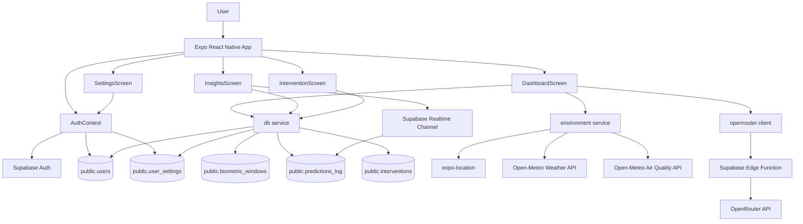
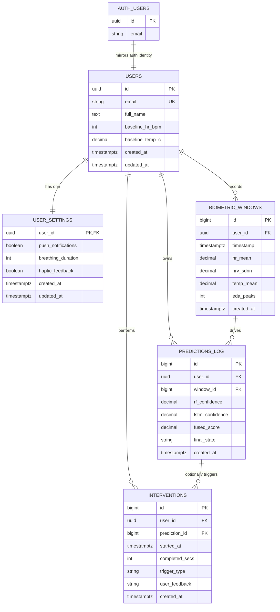
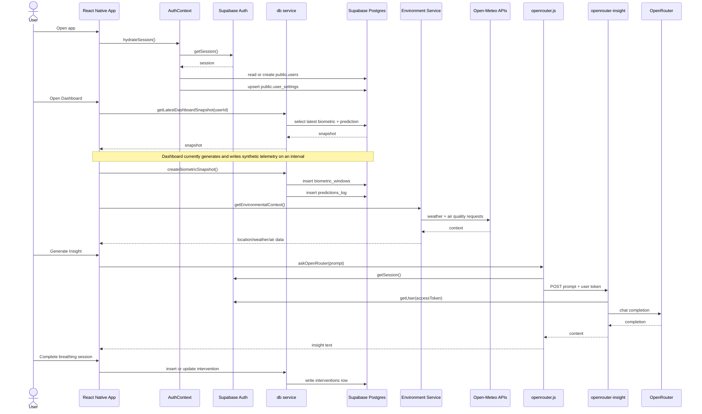
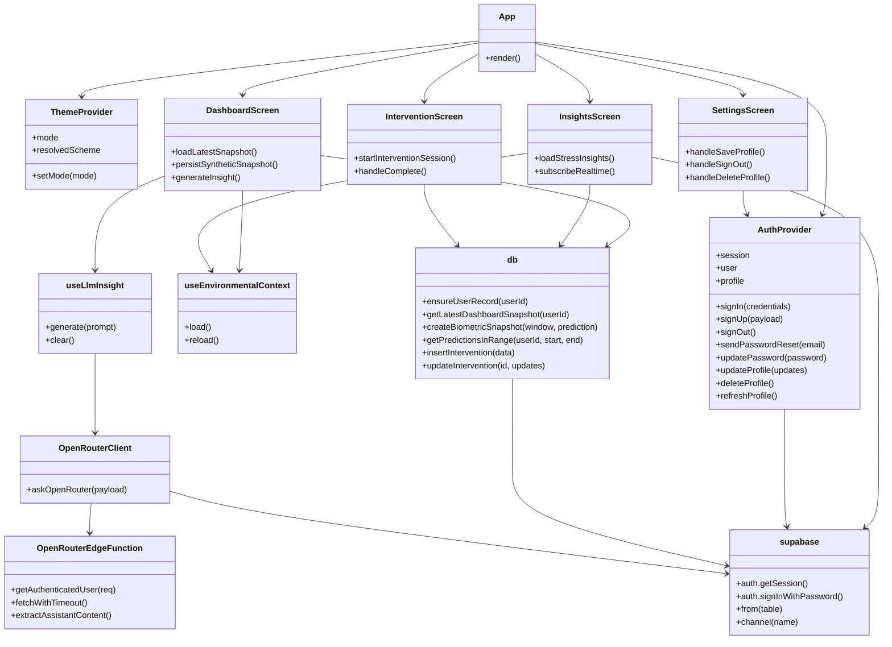

# MindPulse Architecture

This document reflects the current repository state in `App.js`, `src/`, and `supabase/schema.sql`.

Rendered diagram exports and reusable source files are available under `docs/architecture/`.

1. Mermaid source: `docs/architecture/mermaid/`
2. PlantUML source: `docs/architecture/plantuml/`
3. Rendered SVG: `docs/architecture/svg/`
4. Rendered PNG: `docs/architecture/png/`

## System Overview

MindPulse is an Expo React Native client backed by Supabase Auth, Supabase Postgres, and a Supabase Edge Function for LLM insight generation.

Current runtime layers:

1. Mobile UI layer: screens, shared UI components, theme provider, navigation.
2. Application layer: `AuthContext`, hooks, formatting and prompt helpers.
3. Data/service layer: Supabase client, `db` CRUD service, environment service, OpenRouter client.
4. Backend layer: Supabase Postgres tables with RLS and the `openrouter-insight` edge function.

Local persistence:

1. Supabase auth session is stored in AsyncStorage.
2. Login email memory uses AsyncStorage key `auth:remember-email`.
3. There is no local SQL database in the app.

## High-Level Architecture

## ERD

## UML Sequence Diagram

This sequence shows the main end-to-end application flow as currently implemented.

## Class Diagram

The codebase is mostly functional React code rather than classical OOP. The diagram below uses Mermaid class notation to represent module ownership and dependencies.

## Database Schema

### `public.users`

Purpose: application profile row for each authenticated user.

| Column | Type | Notes |
| --- | --- | --- |
| `id` | `uuid` | PK, FK to `auth.users.id`, `on delete cascade` |
| `email` | `varchar(255)` | unique |
| `full_name` | `text` | nullable |
| `created_at` | `timestamptz` | default `now()` |
| `baseline_hr_bpm` | `integer` | nullable baseline |
| `baseline_temp_c` | `decimal(4,2)` | nullable baseline |
| `updated_at` | `timestamptz` | default `now()`, maintained by trigger |

Policies:

1. Select/insert/update/delete allowed only when `auth.uid() = id`.

### `public.user_settings`

Purpose: per-user preferences.

| Column | Type | Notes |
| --- | --- | --- |
| `user_id` | `uuid` | PK, FK to `public.users.id`, `on delete cascade` |
| `push_notifications` | `boolean` | default `true` |
| `breathing_duration` | `integer` | default `60` |
| `haptic_feedback` | `boolean` | default `true` |
| `created_at` | `timestamptz` | default `now()` |
| `updated_at` | `timestamptz` | default `now()`, maintained by trigger |

Policies:

1. Select/insert/update/delete allowed only when `auth.uid() = user_id`.

### `public.biometric_windows`

Purpose: aggregated biometric sensor samples.

| Column | Type | Notes |
| --- | --- | --- |
| `id` | `bigserial` | PK |
| `user_id` | `uuid` | FK to `public.users.id`, `on delete cascade` |
| `timestamp` | `timestamptz` | domain event time |
| `hr_mean` | `decimal(5,2)` | heart rate mean |
| `hrv_sdnn` | `decimal(6,2)` | HRV metric |
| `temp_mean` | `decimal(4,2)` | skin temperature mean |
| `eda_peaks` | `integer` | electrodermal peaks |
| `created_at` | `timestamptz` | default `now()` |

Indexes:

1. `idx_biometric_windows_user_id`
2. `idx_biometric_windows_timestamp`
3. `idx_biometric_windows_user_timestamp`

Policies:

1. Select/insert allowed only when `auth.uid() = user_id`.

### `public.predictions_log`

Purpose: model outputs linked to a biometric window.

| Column | Type | Notes |
| --- | --- | --- |
| `id` | `bigserial` | PK |
| `user_id` | `uuid` | FK to `public.users.id`, `on delete cascade` |
| `window_id` | `bigint` | FK to `public.biometric_windows.id`, `on delete cascade` |
| `rf_confidence` | `decimal(3,2)` | Random Forest score |
| `lstm_confidence` | `decimal(3,2)` | LSTM score |
| `fused_score` | `decimal(3,2)` | final ensemble score |
| `final_state` | `varchar(20)` | `Stressed` or `Relaxed` |
| `created_at` | `timestamptz` | default `now()` |

Indexes:

1. `idx_predictions_user_id`
2. `idx_predictions_window_id`
3. `idx_predictions_created_at`

Policies:

1. Select/insert allowed only when `auth.uid() = user_id`.

### `public.interventions`

Purpose: breathing exercise events and user feedback.

| Column | Type | Notes |
| --- | --- | --- |
| `id` | `bigserial` | PK |
| `user_id` | `uuid` | FK to `public.users.id`, `on delete cascade` |
| `prediction_id` | `bigint` | nullable FK to `public.predictions_log.id`, `on delete set null` |
| `started_at` | `timestamptz` | intervention start |
| `completed_secs` | `integer` | duration in seconds |
| `trigger_type` | `varchar(20)` | `Automatic` or `Manual` |
| `user_feedback` | `varchar(20)` | nullable, `Better`, `Same`, `Worse` |
| `created_at` | `timestamptz` | default `now()` |

Indexes:

1. `idx_interventions_user_id`
2. `idx_interventions_prediction_id`
3. `idx_interventions_started_at`

Policies:

1. Select/insert/update allowed only when `auth.uid() = user_id`.

## Triggers And Functions

1. `public.handle_new_user()`
   Seeds `public.users` and `public.user_settings` after `auth.users` insert.
2. `public.set_updated_at()`
   Maintains `updated_at` for `public.users` and `public.user_settings`.
3. `on_auth_user_created`
   Trigger on `auth.users`.
4. `set_users_updated_at`
   Trigger on `public.users`.
5. `set_user_settings_updated_at`
   Trigger on `public.user_settings`.

## Notable Implementation Notes

1. `DashboardScreen` hydrates the latest database snapshot, then generates synthetic biometric and prediction data on a fixed interval.
2. `InsightsScreen` reads `predictions_log` for the last seven days and also subscribes to Supabase realtime updates on that table.
3. `InterventionScreen` links new intervention rows to the latest prediction when available.
4. `SettingsScreen` currently persists profile fields through `AuthContext`, but the notification toggle and wearable connection state are only local UI state.
