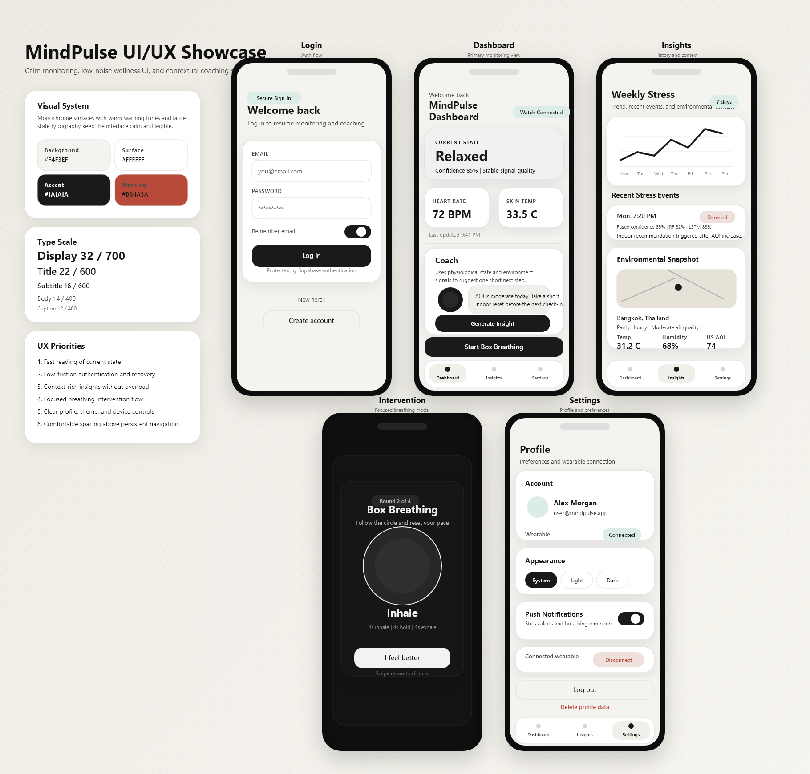
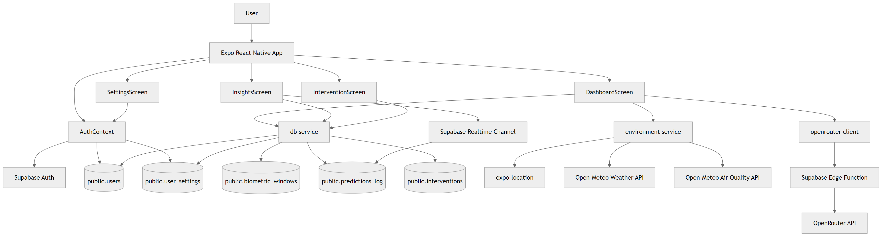

# MindPulse Mobile

<p align="center">
  
  
  
  
</p>

MindPulse is an Expo React Native mobile app for stress-awareness workflows. It combines authentication, wearable-style biometric monitoring, environmental context, and LLM-generated coaching into a calm, low-noise mobile interface.

The current repository includes the app client, Supabase schema, a Supabase Edge Function for LLM insights, architecture diagrams, and generated UI/UX showcase assets.

## Preview

<p align="center">
  
</p>

## Table of Contents

- [Overview](#overview)
- [Key Features](#key-features)
- [Architecture](#architecture)
- [Tech Stack](#tech-stack)
- [Repository Structure](#repository-structure)
- [Getting Started](#getting-started)
- [Environment Variables](#environment-variables)
- [Supabase Setup](#supabase-setup)
- [Edge Function Setup](#edge-function-setup)
- [Available Scripts](#available-scripts)
- [Documentation](#documentation)
- [Implementation Notes](#implementation-notes)

## Overview

MindPulse is organized around three primary user experiences:

- `Dashboard`: current physiological state, key metrics, environmental context, and an LLM-generated coaching suggestion.
- `Insights`: weekly stress chart, recent stress events, realtime prediction updates, and a location-aware environmental snapshot.
- `Intervention`: a focused box-breathing modal used for manual or stress-triggered recovery flow.

Supporting flows include authentication, registration, password recovery, theme selection, wearable connection state, and Supabase-backed user/profile storage.

## Key Features

- Email/password authentication with login, registration, forgot password, and reset password flows.
- Theme-aware interface with system, light, and dark modes.
- Dashboard state cards for heart rate, skin temperature, HRV, EDA peaks, and fused prediction confidence.
- Environmental context using `expo-location` plus Open-Meteo weather and air-quality APIs.
- LLM insight generation through a protected Supabase Edge Function and OpenRouter.
- Weekly stress trend visualization with recent-event summaries.
- Realtime insights refresh using Supabase Postgres changes.
- Leaflet map rendering inside a `WebView`.
- Box-breathing intervention flow.
- Generated architecture diagrams and UI/UX documentation bundled with the repo.

## Architecture

<p align="center">
  
</p>

At a high level, the app is composed of:

- An Expo React Native client for UI, navigation, hooks, theme management, and local auth/session handling.
- Supabase Auth for identity and session management.
- Supabase Postgres for user, settings, biometric, prediction, and intervention records.
- An environment service that fetches weather and air-quality context from Open-Meteo.
- A Supabase Edge Function that validates the user session and proxies coaching prompts to OpenRouter.

More diagrams and exports are available in [docs/architecture/README.md](docs/architecture/README.md).

## Tech Stack

| Area | Implementation |
| --- | --- |
| Mobile framework | [Expo](https://expo.dev/) SDK 54 |
| UI runtime | [React Native](https://reactnative.dev/) 0.81 + React 19 |
| Navigation | `@react-navigation/native`, bottom tabs, native stack |
| Backend | [Supabase](https://supabase.com/) Auth + Postgres + Edge Functions |
| LLM gateway | [OpenRouter](https://openrouter.ai/) via Supabase Edge Function |
| Environment data | [Open-Meteo](https://open-meteo.com/) weather and air-quality APIs |
| Location | `expo-location` |
| Charts | `react-native-chart-kit` |
| Map rendering | [Leaflet](https://leafletjs.com/) inside `react-native-webview` |
| Motion | `react-native-reanimated` |
| Typing | TypeScript for DB types and service layer support |

## Repository Structure

```text
mindpulsemobile/
|-- App.js
|-- app.json
|-- src/
|   |-- components/
|   |-- constants/
|   |-- contexts/
|   |-- hooks/
|   |-- screens/
|   |-- services/
|   |-- types/
|   `-- utils/
|-- components/ui/
|-- docs/
|   |-- architecture/
|   `-- ui-ux/
|-- scripts/
|   |-- export-architecture-diagrams.mjs
|   `-- export-uiux-showcase.mjs
|-- supabase/
|   |-- schema.sql
|   |-- reset_schema.sql
|   `-- functions/openrouter-insight/index.ts
|-- ARCHITECTURE_DIAGRAMS.md
|-- DATABASE_README.md
|-- IMPLEMENTATION.md
|-- INTEGRATION_EXAMPLES.md
|-- SCHEMA_GUIDE.md
`-- UI_UX_DESIGN.md
```

## Getting Started

### Prerequisites

- Node.js 18 or newer
- npm
- Expo CLI tooling through `npx expo`
- A Supabase project
- An OpenRouter API key stored in Supabase Edge Function secrets

### 1. Install dependencies

```bash
npm install
```

### 2. Configure client environment variables

Create a `.env` file in the project root:

```env
EXPO_PUBLIC_SUPABASE_URL=https://your-project.supabase.co
EXPO_PUBLIC_SUPABASE_ANON_KEY=your-supabase-anon-key
EXPO_PUBLIC_SUPABASE_REDIRECT_URL=mindpulse://reset
```

### 3. Start the app

```bash
npm run start
```

You can also run platform-specific commands:

```bash
npm run android
npm run ios
npm run web
```

### 4. Open in Expo Go or a local simulator

- Use Expo Go for quick client testing.
- Use Android Studio or Xcode simulators for native-device style debugging.

## Environment Variables

| Variable | Required | Purpose |
| --- | --- | --- |
| `EXPO_PUBLIC_SUPABASE_URL` | Yes | Base URL for Supabase Auth, PostgREST, and Edge Functions |
| `EXPO_PUBLIC_SUPABASE_ANON_KEY` | Yes | Public anon key used by the mobile client |
| `EXPO_PUBLIC_SUPABASE_REDIRECT_URL` | Yes | App deep-link target for password reset flow |

Notes:

- Only `EXPO_PUBLIC_*` variables are exposed to the client bundle.
- Keep provider secrets such as `OPENROUTER_API_KEY` out of the app and inside Supabase Edge Function secrets.

## Supabase Setup

### 1. Create the database schema

Open [supabase/schema.sql](supabase/schema.sql) in your Supabase SQL editor and run it to create:

- `users`
- `user_settings`
- `biometric_windows`
- `predictions_log`
- `interventions`

The schema includes relationships, indexes, triggers, and Row Level Security policies.

### 2. Configure the mobile deep-link scheme

The app uses the `mindpulse` scheme defined in [app.json](app.json). Make sure your password reset redirect URL matches it, for example:

```text
mindpulse://reset
```

### 3. Confirm platform permissions

Location-based environmental context requires:

- `ACCESS_FINE_LOCATION` / `ACCESS_COARSE_LOCATION` on Android
- `NSLocationWhenInUseUsageDescription` on iOS

These are already defined in [app.json](app.json).

## Edge Function Setup

The LLM insight flow runs through [supabase/functions/openrouter-insight/index.ts](supabase/functions/openrouter-insight/index.ts).

### 1. Set function secrets

```bash
supabase secrets set OPENROUTER_API_KEY=YOUR_KEY
supabase secrets set OPENROUTER_MODEL=stepfun/step-3.5-flash:free
supabase secrets set OPENROUTER_FALLBACK_MODEL=openrouter/free
supabase secrets set OPENROUTER_REFERER=https://mindpulse.app/
supabase secrets set OPENROUTER_TITLE=MindPulse
supabase secrets set OPENROUTER_TIMEOUT_MS=30000
supabase secrets set OPENROUTER_RETRY_BASE_MS=800
supabase secrets set OPENROUTER_RETRY_COUNT=1
```

### 2. Deploy the function

```bash
supabase functions deploy openrouter-insight
```

### 3. Test locally

If you maintain a local Supabase functions env file, serve the function with:

```bash
supabase functions serve openrouter-insight --env-file supabase/functions/.env
```

## Available Scripts

| Command | Description |
| --- | --- |
| `npm run start` | Start the Expo dev server |
| `npm run android` | Run the Expo Android build locally |
| `npm run ios` | Run the Expo iOS build locally |
| `npm run web` | Start the Expo web target |
| `npm run export:architecture` | Regenerate Mermaid-based architecture PNG/SVG exports |
| `npm run export:uiux` | Regenerate the UI/UX showcase PNG/SVG |

## Documentation

Project documentation and generated assets included in this repository:

- [Architecture diagrams overview](ARCHITECTURE_DIAGRAMS.md)
- [Architecture export bundle](docs/architecture/README.md)
- [UI/UX design specification](UI_UX_DESIGN.md)
- [Database implementation notes](DATABASE_README.md)
- [Schema guide](SCHEMA_GUIDE.md)
- [Implementation notes](IMPLEMENTATION.md)
- [Integration examples](INTEGRATION_EXAMPLES.md)
- [UI/UX showcase SVG](docs/ui-ux/mindpulse-uiux-showcase.svg)
- [UI/UX showcase PNG](docs/ui-ux/mindpulse-uiux-showcase.png)

## Implementation Notes

- The current app is a prototype/research-style implementation and not a medical device.
- Dashboard biometric updates are currently generated from synthetic/demo data logic in the client before being written through the DB service. Replace this path with a real wearable ingestion pipeline before production use.
- Environmental features require location permission and active internet access.
- LLM coaching requires a reachable Supabase Edge Function plus valid OpenRouter credentials on the backend.
- There is no automated test suite configured in `package.json` at the moment.

## Screen Summary

| Screen | Purpose |
| --- | --- |
| `LoginScreen` | Sign in and entry point to auth flow |
| `RegisterScreen` | New account creation |
| `ForgotPasswordScreen` | Password reset request |
| `ResetPasswordScreen` | Password update after recovery link |
| `DashboardScreen` | Live status, metrics, environment, and coaching |
| `InsightsScreen` | Weekly chart, recent events, and environmental snapshot |
| `InterventionScreen` | Breathing intervention modal |
| `SettingsScreen` | Theme, profile, wearable, and notification controls |

## Related Assets

If you want to reuse the generated visuals in reports or presentations:

- [UI/UX board PNG](docs/ui-ux/mindpulse-uiux-showcase.png)
- [UI/UX board SVG](docs/ui-ux/mindpulse-uiux-showcase.svg)
- [High-level architecture PNG](docs/architecture/png/high-level-architecture.png)
- [ERD PNG](docs/architecture/png/mindpulse-erd.png)
- [Application sequence PNG](docs/architecture/png/application-sequence.png)
- [Class diagram PNG](docs/architecture/png/application-class-diagram.png)
