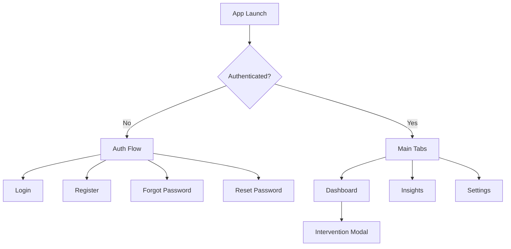

# MindPulse UI/UX Design

This document describes the implemented UI/UX design of the MindPulse mobile application based on the current codebase in `App.js`, `src/screens`, `src/components`, `src/constants`, and `components/ui`.

## 1. Design Intent

MindPulse uses a restrained, low-noise visual system intended to feel calm, clinical, and trustworthy. The interface avoids bright gradients, saturated accents, and decorative clutter. Instead, it relies on:

1. Neutral monochrome surfaces.
2. Soft contrast between background, card, and border.
3. Large status typography for current emotional state.
4. Compact supporting copy and clear call-to-action buttons.
5. A subtle textured backdrop to avoid flat screens without increasing visual fatigue.

The design language is consistent with a wellness application that should feel composed rather than stimulating.

## 2. Product UX Goals

The current experience is optimized around five UX goals:

1. Make the current state readable within a few seconds.
2. Reduce friction in authentication and account recovery.
3. Present environmental and AI insight data without overwhelming the user.
4. Keep breathing intervention flow simple and emotionally reassuring.
5. Allow profile and appearance changes without leaving the main app shell.

## 3. Information Architecture

### Navigation Model

1. Authentication uses a stack navigator with hidden headers.
2. Main application uses a three-tab bottom navigation: Dashboard, Insights, Settings.
3. Breathing intervention is presented as a modal screen above the main tab shell.
4. Theme is global and shared across screens through `ThemeProvider`.

## 4. Visual Design System

### 4.1 Color Strategy

The palette is intentionally limited. Primary emphasis comes from black or white depending on theme, while semantic feedback uses warm warning tones.

#### Light Theme

1. Background: `#F4F3EF`
2. Surface: `#FFFFFF`
3. Surface Alt: `#F0EFEA`
4. Primary Text: `#1A1A1A`
5. Secondary Text: `#4A4A4A`
6. Border: `#DADADA`
7. Accent: `#1A1A1A`
8. Warning: `#B84A3A`

#### Dark Theme

1. Background: `#0F0F0F`
2. Surface: `#151515`
3. Surface Alt: `#1B1B1B`
4. Primary Text: `#F2F2F2`
5. Secondary Text: `#B5B5B5`
6. Border: `#2A2A2A`
7. Accent: `#F2F2F2`
8. Warning: `#E07A5F`

#### Semantic State Colors

1. Calm cards use neutral cool-gray surfaces.
2. Stress cards use muted warm surfaces.
3. Destructive actions use red-tinted backgrounds or labels.

### 4.2 Typography

Typography is hierarchical and functional rather than expressive.

1. `display`: 32 px, bold, used for primary emotional state.
2. `title`: 22 px, semibold, used for screen headings.
3. `subtitle`: 16 px, semibold, used for section headings.
4. `metric`: 20 px, semibold, used for key numeric values.
5. `body`: 14 px, regular, used for descriptive text.
6. `caption` and `captionSm`: used for metadata, helper text, and low-emphasis copy.
7. `overline`: uppercase utility label for small card headings.

### 4.3 Spacing and Shape

The spacing scale is compact and consistent:

1. `xxs`: 4
2. `xs`: 6
3. `sm`: 10
4. `md`: 16
5. `lg`: 20
6. `xl`: 24
7. `xxl`: 32

Corners are softly rounded:

1. `sm`: 12
2. `md`: 16
3. `lg`: 20
4. `xl`: 24

The overall effect is modern and tactile without appearing overly playful.

### 4.4 Background Treatment

Every screen sits on a shared backdrop composed of:

1. A gentle vertical gradient from background to surface.
2. A dotted pattern overlay with low opacity.

This gives the app a premium atmosphere while preserving readability.

## 5. Core UI Components

### 5.1 Screen Container

`Screen` provides:

1. Safe full-screen layout behavior.
2. Shared horizontal and vertical padding.
3. Optional scrolling.
4. A persistent branded backdrop.

### 5.2 Cards

Cards are the main information container. They are used for:

1. Authentication forms.
2. Dashboard status sections.
3. Insights chart and event history.
4. Settings groups.
5. Intervention modal content.

Card styling emphasizes:

1. Full-width content.
2. Soft border.
3. Rounded corners.
4. Moderate internal padding.

### 5.3 Buttons

Buttons support several variants:

1. Default primary action.
2. Outline secondary action.
3. Secondary neutral action.
4. Destructive action.
5. Link action for lightweight navigation.

Behavioral details:

1. Press animation scales slightly for tactile feedback.
2. Optional iOS haptic feedback is triggered on press.
3. Loading state swaps label for a spinner.

### 5.4 Badges

Badges are used for lightweight status communication such as wearable connectivity.

### 5.5 Siri Orb

The orb is the app's most expressive visual element. It reinforces the AI coaching feature through:

1. Pulsing glow.
2. Rotating sheen.
3. Subtle scale animation.

It functions as both a decorative and stateful feedback element.

### 5.6 Map

The map is used in Insights to visualize current location context. It is non-interactive by default to prevent accidental scroll or gesture conflicts.

## 6. Screen-by-Screen UX Design

### 6.1 Login Screen

Purpose:

1. Authenticate returning users quickly.

Layout:

1. Centered title and subtitle.
2. Single card containing email, password, and remember-email toggle.
3. Primary login action.
4. Secondary actions for password recovery and account creation.

UX strengths:

1. Clear hierarchy.
2. Low cognitive load.
3. Support for remembered email reduces repeat typing.

### 6.2 Register Screen

Purpose:

1. Create a new account with minimal required inputs.

Layout:

1. Introductory title and subtitle.
2. Card form with full name, email, and password.
3. Inline notice state for email confirmation.
4. Return path back to login.

UX strengths:

1. Minimal fields.
2. Success notice is shown in-place rather than redirecting unexpectedly.

### 6.3 Forgot Password Screen

Purpose:

1. Request a password reset email.

Layout:

1. One-field form inside a card.
2. Immediate success or error feedback.
3. Back link to login.

UX strengths:

1. Extremely focused single-task flow.

### 6.4 Reset Password Screen

Purpose:

1. Set a new password after recovery link authentication.

Layout:

1. Two password fields for confirmation.
2. Inline validation for password length and matching.
3. Primary update action and a simple back action.

UX strengths:

1. Prevents avoidable submission errors.
2. Keeps the recovery flow self-contained.

### 6.5 Dashboard Screen

Purpose:

1. Serve as the primary emotional-state and coaching home screen.

Layout:

1. Greeting row with wearable connection badge.
2. Large current-state card with confidence label.
3. Two metric cards for heart rate and skin temperature.
4. Last-updated and sync-error footer.
5. AI coach card with orb, speech bubble, and action buttons.
6. Full-width breathing CTA at the bottom.

UX strengths:

1. Most important information appears above the fold.
2. State card uses size and contrast to direct attention immediately.
3. AI recommendation is separated from raw telemetry, which reduces overload.
4. Breathing action is always visible and easy to trigger.

UX character:

1. Calm, assistant-like, and supportive.
2. Numeric enough for credibility, but softened by conversational coaching.

### 6.6 Insights Screen

Purpose:

1. Give users a historical and contextual view of stress-related patterns.

Layout:

1. Weekly stress heading.
2. Chart card showing stress frequency over seven days.
3. Recent stress event cards with model outputs.
4. Environmental context card with embedded map and weather/air metrics.

UX strengths:

1. Separates historical insight from immediate dashboard state.
2. Uses charts for trend recognition and cards for event detail.
3. Environmental card contextualizes stress rather than presenting it as isolated.

### 6.7 Intervention Screen

Purpose:

1. Guide a short box-breathing exercise.

Layout:

1. Full-screen centered modal.
2. Large breathing circle animation.
3. Current phase label.
4. Simple timing row.
5. Single completion button.

UX strengths:

1. Very low distraction.
2. Clear breathing guidance.
3. Modal presentation helps users focus on one calming task.

### 6.8 Settings Screen

Purpose:

1. Provide account, appearance, and device-management controls.

Layout:

1. Profile card with editable full name and read-only email.
2. Appearance card with segmented-style theme buttons.
3. Notification toggle card.
4. Separate stacked actions for disconnect, logout, and delete.

UX strengths:

1. Clear grouping by task type.
2. Destructive actions are visually isolated from routine settings.

## 7. Interaction Design

### 7.1 Feedback States

The interface consistently supports:

1. Loading spinners in buttons and data sections.
2. Inline errors in warning color.
3. Inline notices for success or informational states.
4. Disabled controls when actions are unavailable.

### 7.2 Motion

Motion is used sparingly and purposefully:

1. Button press scaling adds tactility.
2. Siri orb animation communicates AI activity.
3. Breathing circle animation guides inhale, hold, and exhale pacing.
4. Intervention modal uses transparent modal presentation with fade animation.

### 7.3 Theme Switching

Users can choose:

1. System theme.
2. Light theme.
3. Dark theme.

This improves comfort and perceived personalization while preserving the same layout and interaction model.

## 8. UX Writing Style

Microcopy follows these principles:

1. Short sentences.
2. Direct instructions.
3. Low-friction, non-technical tone.
4. Reassuring but not overly sentimental.

Examples:

1. "Welcome back"
2. "Follow the circle and breathe"
3. "Tap Generate Insight to get a short, tailored suggestion."

## 9. Accessibility Considerations

The current UI supports accessibility in several practical ways:

1. Strong contrast in both light and dark themes.
2. Large headline treatment for primary state information.
3. Full-width buttons for touch accessibility.
4. Clear grouping through cards and spacing.
5. Semantic separation of helper text, errors, and section labels.

Areas that still need improvement:

1. No explicit accessibility labels are defined for custom interactive elements.
2. Dynamic text scaling behavior has not been tuned screen by screen.
3. Some color-driven semantic cues could be reinforced with icons or labels.

## 10. Current UX Risks

These issues affect the present experience and should be treated as design-system or product gaps:

1. Push notification and wearable connection settings look persistent but are currently local-only UI state.
2. Dashboard writes synthetic telemetry, which can make insights feel less trustworthy if presented as real sensor data.
3. Delete-profile messaging understates how much data is actually removed.
4. Intervention completion only supports the positive path and does not provide cancel, pause, or alternate feedback states.

## 11. Recommended Next UI/UX Improvements

### Short-Term

1. Persist all visible settings so UI behavior matches user expectation.
2. Clarify destructive-action language in Settings.
3. Add a dismiss or cancel path to the breathing modal.
4. Distinguish simulated data from live wearable data in the dashboard.

### Mid-Term

1. Add onboarding screens that explain how stress, environment, and coaching interact.
2. Introduce richer metric cards for HRV, AQI, and intervention history.
3. Add clearer empty states for first-time users with no history.
4. Support more detailed feedback choices after interventions.

### Long-Term

1. Expand personalization through adaptive coaching tone and intervention suggestions.
2. Add a more complete wearable connection flow with setup, pairing, and troubleshooting.
3. Introduce longitudinal weekly and monthly wellness summaries.

## 12. Summary

The implemented MindPulse UI/UX design is built around calm readability, low-friction interaction, and trust-oriented presentation. Its strongest qualities are a coherent visual system, fast comprehension of current emotional state, and a disciplined use of motion and layout. The product already establishes a credible foundation for a wellness experience, with the main next step being alignment of visible settings and insight screens with persistent, production-grade behavior.
