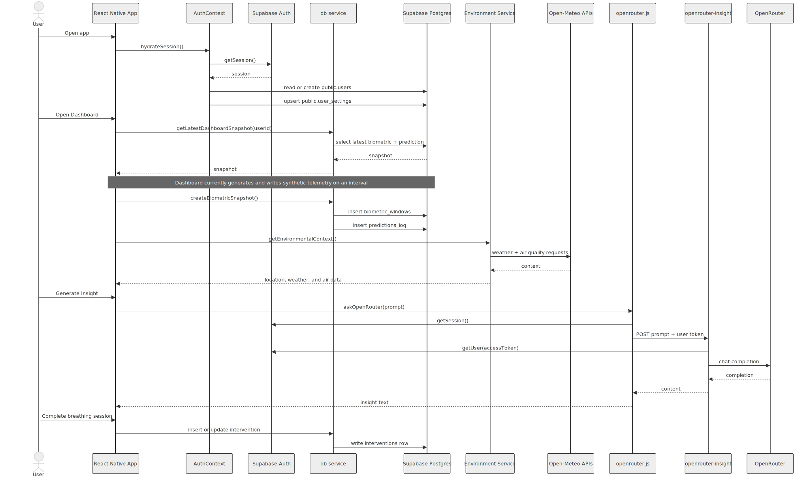

# Architecture Exports

This folder contains reusable source files and rendered assets for the MindPulse architecture diagrams.

## Contents

1. Mermaid source: `./mermaid/`
2. PlantUML source: `./plantuml/`
3. SVG exports: `./svg/`
4. PNG exports: `./png/`

## Regenerate

Run:

```bash
npm run export:architecture
```

## Diagram Set

### High-Level Architecture

Mermaid: `./mermaid/high-level-architecture.mmd`

PlantUML: `./plantuml/high-level-architecture.puml`

SVG:



### ERD

Mermaid: `./mermaid/mindpulse-erd.mmd`

PlantUML: `./plantuml/mindpulse-erd.puml`

SVG:



### Application Sequence

Mermaid: `./mermaid/application-sequence.mmd`

PlantUML: `./plantuml/application-sequence.puml`

SVG:



### Application Class Diagram

Mermaid: `./mermaid/application-class-diagram.mmd`

PlantUML: `./plantuml/application-class-diagram.puml`

SVG:


